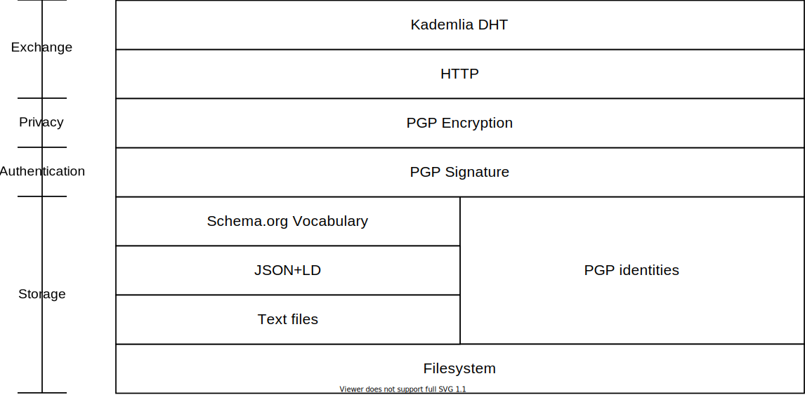

This document describes a peer-to-peer (P2P) social applications convention. We are utilizing the filesystem, PGP, and Kademlia protocol for storage, privacy, peer discovery, and routing, respectively without any supporting data structures.

<p align="center">
  
</p>

<!-- markdown-toc start - Don't edit this section. Run M-x markdown-toc-refresh-toc -->
**Table of Contents**

- [Problem](#problem)
- [Alternative Solutions](#alternative-solutions)
- [Requirements](#requirements)
- [Core concept](#core-concept)
    - [Storage](#storage)
    - [Data format](#data-format)
    - [Schema](#schema)
    - [Authentication and Authorization](#authentication-and-authorization)
    - [Data Exchange](#data-exchange)
- [Benefits](#benefits)
- [Technical Details](#technical-details)
    - [Addressing](#addressing)
    - [Directory structure](#directory-structure)
    - [Versioning](#versioning)
    - [HTTP server interface](#http-server-interface)
    - [Peer to Peer Stack](#peer-to-peer-stack)
        - [MDNS Service discovery](#mdns-service-discovery)
        - [Listening on internet requests](#listening-on-internet-requests)
        - [Kademlia Routing](#kademlia-routing)
- [Architecture Diagram](#architecture-diagram)
- [Roadmap](#roadmap)
- [Challenges](#challenges)
- [Project Status](#project-status)
- [Getting involved](#getting-involved)
- [License](#license)
- [TODOs](#todos)
- [FAQ](#faq)
    - [Why are keys written in binary format?](#why-are-keys-written-in-binary-format)
    - [Why are friends keys encrypted?](#why-are-friends-keys-encrypted)

<!-- markdown-toc end -->


# Problem

* The current popular social applications stagnated leading to a halt in innovation and privacy issues.
  * Popular social media networks lack an organized way to post structured content such as a recipe or a technical blog post or information about a disease or a chemical formula or a mathematical equation.
  * Many social media networks were involved in personal information leak incidents that led to users' arrest or twisting of democratic elections.

* [Walled gardens problem](https://en.wikipedia.org/wiki/Closed_platform): Users can't move their data between social applications leading to duplication of the same content for the same person on multiple social media networks. We perceive that as a symptom of their incompatibility.

* Ads intrusive behavior as a result of the excessive user tracking and signals extraction from user content and behavior on the network and other affiliate websites.

* Users are not in control of their data and its privacy. Trusting the application operator to manage their data as they're instructed by the tools presented to the users. Tools that are inherently biased and have limited controls over data.

* Centralization issue: Where sending someone a message in the other room means the message has to travel to the nearest data center which can be in another continent then comes back again to the room next to you. that's not sane behavior by any stretch.

* [Censorship](https://en.wikipedia.org/wiki/Censorship#Social_media): Social applications set biased guidelines that are suitable for some of the users and not others because of differences in cultures between countries. even cities in one country have different habits and behaviors. even between families in the same city.
  * acting as a big brother to all of the application users isn't a good situation. this is an inherent disadvantage of hosting users' content.

* Lying by omission: Where content feeds are manipulated by an algorithm that is both flawed and biased to the users. taking away the user's freedom to choose what to be displayed and in which order.

# Alternative Solutions

For the past years, many projects were initiated to solve this problem. Some solutions were drifting towards federated applications others towards complete peer-to-peer communication. [We learned a lot by following what they achieved and built](https://matrix.org/_matrix/media/r0/download/twitter.modular.im/981b258141aa0b197804127cd2f7d298757bad20).

In our point of view, some shortcomings were inherited from each approach adopted:

* [Federated networks](https://en.wikipedia.org/wiki/Federation_(information_technology)) suffer from a high population in 2 or 3 servers leading to maintenance difficulties. and moderation nightmare for the people responsible for these servers.
* Some applications went for an implementation that doesn't allow the freedom of editing and manipulating your own data which is against what we believe is the simplest freedom on a social network.
* Some applications suffered from a monolithic implementation where everything is set in stone with no room for changes or evolution. like what algorithms to use and which parameters and how nodes interact together and which hashes to use. which will make it very painful in the future to upgrade the network.
* Most of the implementations except for (heypercore, IPFS) utilizes opaque storage where the user can't access his own data without the tool provided by the social network. replicating the walled gardens problem all over again.
* Some protocols went for data formats and vocabulary that try to replicate current social media instead of reflecting real life. This renders clients that decide to implement it helpless in expressing real-life behavior and user needs.

# Requirements

The solution we are aiming for should:

- A small set of core concepts
- Works well with the current web
- Uses filesystem structure as a data storage
- Allows the user to switch clients without losing their data
- Utilizes well-established encryption primitives and exchange protocols
- User has total control over their data privacy
- Flexible to evolve over time and adapt to advancements in cryptography and presentation formats

# Core concept

The following section will describe a concept for building P2P social applications. The concept fulfills the previous requirements. We will refer to it initially by **[𓃠 Mau](https://en.wikipedia.org/wiki/Egyptian_Mau)**.

## Storage

Extending the Unix approach [everything is a file](https://en.wikipedia.org/wiki/Unix_philosophy) to the social applications will make any social application implementation a mere application that reads files from the user machine.

We will present each piece of content on **𓃠 Mau** as a file in the user file system.

This will lead to interesting properties:

* Backing up your content will be a simple `tar` command for example
* Restoring your content to a previous state can be achieved by restoring one of your backups.
* The user will be able to post and read posts from any application that can access your disk like a command-line tool, an extension in your text editor, a desktop GUI. and on phones any App that has permission to access the disk
* Deleting the user's copy of the data will be a simple directory deletion.
* Data can live on a local machine storage device or remote device accessed by any network file system.

## Data format

Using unstructured text will not be sufficient to represent all kinds of content created by users. a piece of content that represents a simple status update should have a different structure than a recipe or a technical blog post or a doctor sharing disease information. or an athlete sharing his bike ride.

JSON has wide support from popular programming languages. Using it as a content format will introduce structure to the data. while making it still readable by any text editor.

## Schema

JSON by itself is a format that defines a set of primitive data types (int, float, boolean, null, array, object). making sure all clients understand each other means we need to use the same name for the same concept. a title of an article should be called "title" for example not "header".

Instead of inventing a new schema, we can use the existing [Schema.org](https://schema.org/docs/full.html) catalog of vocabulary.

This will lead to the following benefits:

- Content attributes can have a single value or multiple values for each language
- Specialized clients can extend the vocabulary for their special uses while other clients will ignore types that are not supported.
- Websites that use JSON+LD will have content that's already understandable by **𓃠 Mau** clients leading to natural intercommunication between **𓃠 Mau** clients and the existing web.
- Any website can be extended with JSON+LD data that represent the content of the website itself as a social profile on **𓃠 Mau** clients.
- Other Vocabulary can be supported gradually like ActivityPub or others. while old clients can ignore this new vocabulary.
- All activities can be presented as Schema.org type such as SocialMediaPosting, API Reference, Book, FollowAction, LikeAction, DislikeAction...etc

## Authentication and Authorization

While public posts are meant to be read by anyone. We still need to:

- Identify the user.
- Verify the authenticity of the user content.
- Restrict access to private or draft content.
- Limit sharing to specific people.
- Keep track of a contact list and their identifiers on the network.

PGP messages is a well [established standard](https://tools.ietf.org/html/rfc4880) that can be used to:

- Generate a key pair for the user that identify him on the network.
- The key/subkey can be used to sign all content to prevent tampering.
- Adding someone to the contact list is as simple as getting his public key and adding it to the local trusted keyring.
- Private content can be encrypted by the user's public key
- Private messages to another user can be encrypted by their public key
- PGP allows encrypting a file to multiple people at the same time
- Mark the date of signing/encrypting a file without depending on the filesystem properties.

This leads to the following features of the system:

- Private content is protected cryptographically
- End-to-end encrypted content. applications can't read user content without the user's permission
- Password-protected identity
- Protection against data leaks. Even if the directory was accessed by a malicious application all files are encrypted for their respective recipients with an exception of the public content.
- Content is signed cryptographically which prevents temperament
- Content can be relayed through a third party without reading the content
- Content can be sent in an encrypted email message.
- The user can pick his own algorithms for encryption/signing/authentication as he wishes without limiting him to specific algorithms or key lengths.
- Content is compressed before encryption reducing the size on the disk
- Granular privacy for every piece of information on the network:
  - A FollowAction for example can be public (not encrypted). Shared with one of my friends (encrypted for my friend) or shared with a specific list of my friends (encrypted for multiple recipients). This applies on a file-by-file basis.
  - A Message can be encrypted to one person for a private end-to-end chat or multiple recipients for a group chat.
- Using trust levels in the PGP keyrings can be beneficial.
  - a peer with a key of `never` trust level should be ignored by any communication software and his content never be written to the disk.

## Data Exchange

Files that are created by one user need to be copied to all peers that are asking for this content. the simplest interface that can serve the files and provide interoperability with the current web is an HTTP interface.

The simplest form is an HTTP server that has 3 endpoints:
- `/files`: which lists all files created by the user
- `/files/<file-name>`: which downloads the latest version of a file
- `/files/<file-name>/versions/<version-hash>`: to download a specific content version

This will provide an interface to download public files that don't need authentication.

The list of files will get longer over time so:
- Client can keep track of the last update time
- Client will send the update time as a value for the HTTP header `If-Modified-Since`
- The server `/files` endpoint should return only the files list modified after the provided date. Ordered by oldest first and can limit the response if needed.
- Client will download the list of modified files.

The size of each file can be added to the `/files` response to make sure Clients don't download files too large. A `SHA` sum of the file can be also added to the same endpoint to make sure the remote file is not the same as the local file before downloading.

Extending the endpoints for `/<user-fingerprint>/files`, `/<user-fingerprint>/files/<filename>` and `/<user-fingerprint>/files/<file-name>/versions/<version-hash>` will allow a user to relay other people content if desired. allowing a user to distribute comments on his content for example from other users.

Adding TLS1.3 to the HTTP interface will allow both sides to identify themselves with their identity keys. The interface in this case can limit the files response to the public files and files encrypted for the requesting user. This will allow users to exchange private messages/content over a secure connection while the content itself is also encrypted for the receiving party so the user can store the response to his disk without any processing whatsoever.

This will lead to the following benefits:

- Existing websites can implement both endpoints easily to serve public content without the need for any intermediary party to get involved in the process.
- Supporting `Range` HTTP header will lead to resumable downloads for large content files.
- Existing web frameworks can be used to protect the interface against common DDOS attacks. Rate limiting...etc.


# Benefits

* A chat application will:
  * Create [SocialMediaPosting](https://schema.org/SocialMediaPosting) files for example.
  * Sign them with the user's private key.
  * Encrypt it for the current user and for the recipients.
  * Request updates from the other side for synchronization every period.

* A user(A) can post a content
  * Another user(B) will create a comment which user(A) downloads while syncing.
  * Then user(A) can share this comment with his contacts by creating a [ShareAction](https://schema.org/ShareAction).
  * User(C) will sync with user(A) and the ShareAction will contain a reference to User(B) comment.
  * User(C) can either
    * Ask user(A) for the comment if he wishes to serve user(B) comment
    * or ask user(B) directly if he's part of his contacts list.
  * This means the comment itself can have privacy of its own and sharing the comment can have additional privacy which reduces the scope of the original comment.

* File name will act as an ID for this user so updating the file will reflect on anyone who keeps synchronizing.

* Multiple applications can work on the same data at the same time. so a chat application can create and update files while a game of chess is also working on creating and updating files of its types without collision.

* Notifications can be derived from new content.
  * An application can listen on files changes and notify the user of new [UserComment](https://schema.org/UserComments) content.

* IOT machines can have the protocol over Bluetooth Low Energy (BLE) transport and use special vocabulary to let the user access its functionalities

* An ecosystem of services can work in parallel on the user directory without knowing about each other. like indexing service to allow advanced search. or backup service that pushes to a paid remote storage.

* Advances in protocols can be utilized like using QUIC protocol instead of TCP/HTTP/TLS inheriting the benefits of the web as it evolves.

* Even files that are not JSON can live side by side with JSON files encrypted for the current user preventing them from moving to other machines.

* Adapter interfaces can be developed for ActivityPub or Matrix networks.

* A Client can be developed to exchange files over email messages. As PGP content can be exported as armored data.
  * Connecting to SMTP servers to send new posts and check POP3/IMAP servers for new emails with PGP content.
  * And it won't contradict with any other client syncing over another interface as the provided SHA sum from `/files` endpoint will prevent downloading the file again leading to multiple clients syncing over different interfaces.

# Technical Details

## Addressing

We have three entities in our system:

* **User**: Identified by his public key
* **Content**: Identified by file name scoped to the user
* **Content version**: Identified by the content hash

* **Users**:
  * Users identified by their public key fingerprint `FPR` downcase characters
  * Users will be addressed by the address `/p2p/<user-FPR>`
* **Content**
  * The user has the freedom to name his content files as he wishes we'll refer to it by `filename`
  * As the content id has to be scope to the user then the content full address will be `/p2p/<user-FPR>/file/<filename>`
* **Content versions**:
  * When editing a content file the old version should be kept on the disk.
  * Addressing a version should be scoped by the user and the content `/p2p/<user-FPR>/file/<filename>/version/<version-hash>`
  * Version hash is a SHA256 sum of the content downcase characters.

## Directory structure

* Storing all files under one directory will introduce collision in file names between users. hence we'll have to separate files by user ID hash following the same addressing schema on the file system
```
current-user-FPR:
   content-file-1.pgp
   content-file-2.pgp
   content-file-3.pgp
friend1-FPR:
   friend1-content-file-1.pgp
   friend1-content-file-2.pgp
   friend1-content-file-2.pgp.versions
     QmSmm69zA4TRuScgLuwd4Wd4VWxGAEuWYBnqxLXcBhrNoZ
     QmSmm69zA4TRuScgLuwd4Wd4VXQDzK9gyxcUJaqigU67Mq
   friend1-content-file-3.pgp
friend2-FPR:
   friend2-content-file-1.pgp
   friend2-content-file-2.pgp
   friend2-content-file-2.pgp.versions
     QmSmm69zA4TRuScgLuwd4Wd4VWxGAEuWYBnqxLXcBhrNoZ
     QmSmm69zA4TRuScgLuwd4Wd4VXQDzK9gyxcUJaqigU67Mq
   friend2-content-file-3.pgp
.friend3-FPR:
   friend3-content-file-1.pgp
   friend3-content-file-2.pgp
   friend3-content-file-3.pgp
.mau:
  friend1-FPR.pgp
  friend2-FPR.pgp
  coworkers:
    friend3-FPR.pgp
```

* Directories prefixed with `.` are ignored by the application that downloads new content. can be used to unfollow a friend while keeping his old information. or keep posts that are shared by your friends from users that you don't want to follow.

* `.mau` directory is reserved for friends public key files. saved as `.pgp` in binary format <sup>[?](#why-keys-are-written-in-binary-format)</sup>. each directory file should represent a group of friends. keys can be duplicate (one friend can belong to work and close friend at the same time). account secret/pub key must be named `account.pgp` to make it easy to find among all other keys. `account.pgp` should be the private key export of the PGP identity with subkeys and signatures then symmetrically encrypted with a password of the user choice. All friends public keys should be encrypted with the account key[?](#why-are-friends-keys-encrypted)

* Files are written in [OpenPGP message format](https://tools.ietf.org/html/rfc4880) which is supported by any OpenPGP implementation.

* Directories with the same file name suffixed with `.versions` will include the file old versions.

* Creating a directory with someone key-id-hash is a signal for the sync software to keep it in sync.

* Having this directory structure will make it easier for the HTTP interface to map request path to directory structure.

* Clients can be instructed to encrypt the file for one key or all contacts in a keyring (rendering the keyring as a group of users).

## Versioning

* Initially a file has one version (the latest version) which is written in `<file-name>.pgp`
* When editing the file `<file-name>` and before writing the new version the following should be done to keep track of the versions:
  * Create a directory `<file-name>.pgp.versions/` if it doesn't exist
  * Sum the `<file-name>.pgp` with SHA256. we'll call it `<version-hash>`
  * Write the file old content to `<file-name>.pgp.versions/<version-hash>`
  * Write the new file content after editing to `<file-name>.pgp`
* This will keep the file versions in the user directory
* If another user asked for the latest versions it's already in the usual place `<file-name>.pgp`
* If a user shared a specific version other users can ask for it and will be found in the version directory
* When downloading a new version of the file to the user machine we can follow the same previous steps to keep old versions and prevent the signed version from being lost forever.
* This can be very useful if an application criticaly depend on the file version like contracts signed by users.

## HTTP server interface

Serving files through HTTP is the interface where one peer can ask the another peer for changed files since last update. and it should adhere to the following [swagger specifications](api.yml)

Authentication should happen in the security layer with both peers doing a TLS1.3 handshake with their identity keys to establish a secure communication.

## Peer to Peer Stack

Using a reduced Kademlia routing protocol over TCP/HTTP allows peers to find other peers using their public key fingerprint and authenticate all requests using mutual-TLS allows passing any needed information in the certificate such as IP addresses, DNS names. effectively reusing what the websites already have.

* **Transport protocol**: HTTP2/TCP
* **Discovery/Routing**: mDNS, Kademlia routing protocol, DNS (for existing websites interoperability)

The previous stack should allow peers discovery over the same network. or with S/Kademlia-DHT routing if not on the same network.

### MDNS Service discovery

If local network is desired the service may announce itself on the network using MDNS multicast. The service name format must be as follows:

```
5D000B2F2C040A1675B49D7F0C7CB7DC36999D56._mau._tcp.local.
|------------ Fingerprint --------------|app-|protocol|domain|
```

- Fingerprint: corresponds to the instance user public key fingerprint
- app: corresponds to the application name
- protocol: tcp
- domain: should be always "local"

### Listening on internet requests

The program is responsible for allowing the user to receive connections from outside of local network by utilizing NAT traversal protocols such as UPNP, NAT-PMP or Hole punshing.

### Kademlia Routing

Kademlia protocol specify short list of RPC calls:

- PING: to make sure the node still connected
- FIND_NODE: to find a list of nodes near a target node. recursively calling the resulting nodes converge on the target node
- STORE: stores a key and a value in the node
- FIND_VALUE: looks up a key in the network to find its stored value

Differences with Kademlia:

- In our case we don't need to store values so the last two RPCs are removed from **Mau** needed RPCs, simplifying the requirements to implement the convention.
- Kademlia node ID was meant to be random 160 bit key. in our case we can use the public key fingerprint which is 160 bits.
- mutual TLS will allow exchanging the certificate for any two connected nodes. which means both nodes knows each other public keys and fingerprints. including the DNSNames list or IPAddresses in the certificate allows peers to know the address of the node (hostname and port) or (IP and port)
- Instead of using UDP port we'll reuse the same HTTP server and have the requests/responses uses HTTP protocol with specific paths
    - `/kad/ping` to ping a node, the server side record the client fingerprint and the DNS address from the TLS certificate
    - `/kad/find_peer/<FPR>` to ask for the nearest known nodes for a target node fingerprint (FPR). should return a list of fingerprints and addresses.
- all requests to the `/kad` routes will have the side effect of adding the requesting node to the serving node contact list.
- Kademlia refer to application instance as a `Node`. instead Mau uses the word Peer as in **Peer to Peer** network to eliminate the confusion of naming the instance two different names (node, peer).

# Architecture Diagram




# Roadmap

The following is a minimum list of modules that is needed to make up the core functionality of **𓃠 Mau**:

* [x] **account**: An interface to create and manage file system structure and keyrings.
* [x] **editor**: An interface that creates and edits encrypted JSON+LD (schema.org) files for existing user and friends.
* [x] **syncer**: A daemon that implement the peer to peer stack. it downloads new content.
* [x] **server**: A deamon that exposes existing content via HTTP interface.
* [x] **peer**: A deamon that allow P2P networking, peer announcement and discovery over local network and the internet
* [ ] **browser**: An interface to show content in chronological order

# Challenges

* **Versioning propagation**: After User(B) shares his version to his social network: the content could change to add more references or fix mistakes leading to User(B) social network browsing the old version. As there is no way to get updates on the content after the first share.

* **Groups**: The concept support sharing to multiple people. which can work as private group. if a hash tag is used to mark content it can be separated by hash. User can pin hashes then browse all local content in it. so hash tag can be synonym to group name. all or this works only if users are following each other so the content flows from one person to the next if they shared it together. so if one person posted to a hashtag the rest of the people won't know about him unless one of them is following him and decides to share his content on this hashtag. so the implementation will be hard to reason about.

* **Multiple devices**: Accessing one account from multiple devices isn't possible with the current concept state.

* **Key revocation**: There is no mechanism to revoke or change keys. unless done manually through another channel like PGP keyservers synchronization.

* **Deletion**: Deletion of a file happens by overwriting the file with empty content and moving the old content to the `.versions` directory. Simply overwriting the file content with empty content will not prove the authenticity of the operation so the file content has to be signed by the author and encrypted to the same users who had access to the file. This means the deleted file size will not be 0 bytes. this means by listing files with the HTTP endpoint the deleted files can't be detected from the size. it has to be downloaded as any other file. and while viewing the files then we'll know that this file is a mark of deletion after decryption which consumes CPU and memory for each deleted file. This also means to delete a file you need to decrypt the file and make sure it's not already deleted otherwise you'll delete a deleted file alredy. I was hoping to know about the deleted files from the files listing HTTP endpoint by its size.

* **mDNS-SD identity proof**: When the user announces his presence on the local network there is no proof the announcement is coming from the account owner.

# Project Status

The project is between refining the concept and writing the Proof of concept phases. This repository includes a proof of concept Go package that can be imported. Also a CLI tool under `cmd/mau` to provide basic interface for the package.

|      State         |  Badge  |
|---------------|--------------------------------------------------------------------------------------------------------------------------------------------|
| Test Coverage | [](https://codecov.io/gh/mau-network/mau)  |
| Documentation | [](https://godoc.org/github.com/mau-network/mau)                          |
| Go Card       | [](https://goreportcard.com/report/github.com/mau-network/mau) |

# Getting involved

The following resources are useful to understand the context around Mau and its powerful concept and limitations. documents doesn't have to be read in order:

- Videos to get from the client-server mindset to P2P mindset:
    - [Imagine This: A Web without servers - Tara Vancil](https://www.youtube.com/watch?v=rJ_WvfF3FN8)
    - [Why IPFS - Juan Benet](https://www.youtube.com/watch?v=zE_WSLbqqvo)
    - [Stanford Seminar - IPFS and the Permanent Web](https://www.youtube.com/watch?v=HUVmypx9HGI)
- Pretty Good Privacy understanding is very important to know the extent of what Mau can reach using it and can't be done too. a starting point for this topic can be wikipedia page and other related implementations:
    - PGP on Wikipedia: https://en.wikipedia.org/wiki/Pretty_Good_Privacy
    - OpenPGP: https://www.openpgp.org/about/
    - OpenPGP message format RFC4880: https://www.rfc-editor.org/rfc/rfc4880
    - GnuPG (GPG): https://en.wikipedia.org/wiki/GNU_Privacy_Guard
    - GnuPG tutorial: https://gnupg.org/gph/en/manual.html
    - GnuPG Made Easy (GPGME): https://gnupg.org/documentation/manuals/gpgme/
- To gain more understanding of JSON+LD and topic around it:
    - JSON-LD: https://json-ld.org/learn.html
    - Schem.org: https://schema.org/docs/documents.html
    - Activity Pub: https://de.wikipedia.org/wiki/ActivityPub
- Understanding HTTP and it's evolutions:
    - HTTP evolution: https://developer.mozilla.org/en-US/docs/Web/HTTP/Basics_of_HTTP/Evolution_of_HTTP
    - HTTP3 cloudflare support: https://blog.cloudflare.com/http3-the-past-present-and-future/
- Understanding how kademlia works and it's enhancements and improvements:
    - Kademlia paper: https://pdos.csail.mit.edu/~petar/papers/maymounkov-kademlia-lncs.pdf
    - S/Kademlia paper: https://telematics.tm.kit.edu/publications/Files/267/SKademlia_2007.pdf
    - Xlattice: https://xlattice.sourceforge.net/

# License

- The project and the implementation is released under GPLv3
- The license protects the community by preventing [Bait and switch](https://debugagent.com/open-source-bait-and-switch).
- It maximize freedom with respect to openness preventing corndering the community in the future.

# TODOs

Project TODOs are mentioned in comments starting with `TODO`.

# FAQ

## Why are keys written in binary format?

- Initially I thought we should accept both formats
   - `.pgp` for binary format
   - `.asc` for ASCII armored format
- But this can make implementing a client harder as client has to
   - detect the file format (binary or ASCII)
   - Implement support for both formats
- Also the `.mau` directory will be inconsistent. some files are binary, others are ASCII


So `.pgp` was prefered as sole format because of these benefits:

- It's simpler to just read the binary format
- `.mau` directory will be consistent
- It saves disk space which is better for limited resources machines such as IOT devices.
- Takes less processing power to deal with the binary format as it doesn't need decoding like ASCII armored. so it'll be better when dealing with thousands of key files.

## Why are friends keys encrypted?

To make sure the friend public key is added by the account instead of a malicious program. If the public key is written in plain format it means adding a friend is not an authenticated operation any program can do it without the user permission
